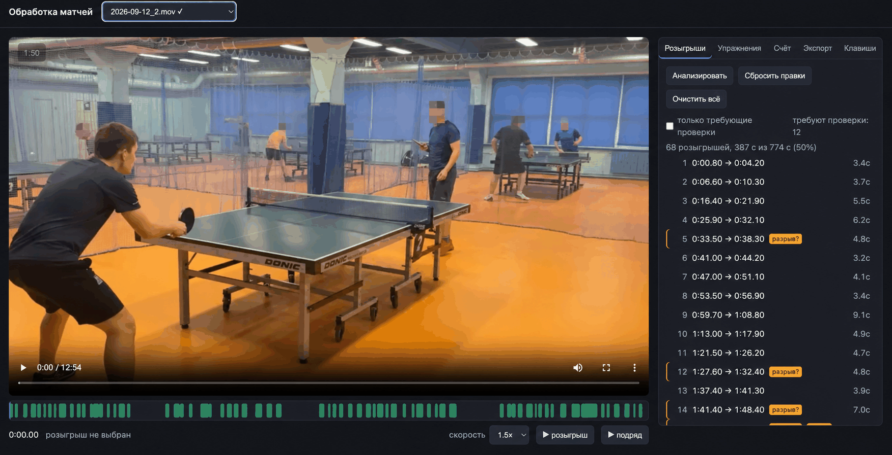

# Разбор видео матчей по настольному теннису

Локальный инструмент: находит розыгрыши в записи матча, ведёт счёт по правилам и
собирает готовое видео — только игра, без пауз между очками. Всё считается на
вашем компьютере, видео никуда не загружается.

Задача, из которой всё выросло: снимаешь матч на телефон со штатива, а потом
полчаса вручную вырезаешь паузы между розыгрышами.

<!--  -->

## Что умеет

- **Находит розыгрыши** и вырезает всё остальное: подбор мяча, подготовку к
  подаче, перерывы между геймами
- **Ведёт счёт** по правилам настольного тенниса, с табло поверх видео
- **Собирает хайлайты** — самые зрелищные розыгрыши матча
- **Правится руками**: границы двигаются клавишами, сомнительные места
  подсвечиваются
- **Режет тренировки** на отдельные ролики по упражнениям

## Качество

Проверено на матче, который модель не видела (обучение на двух других):

| | Полнота | Точность |
|---|---|---|
| Без распознавания поз | 76% | 87% |
| **С распознаванием поз** | **91%** | **96%** |

Границы попадают с точностью около 0.3 секунды. Анализ часового матча занимает
примерно 10 минут на MacBook с M3.

Оговорка: модель обучена на 34 минутах видео из одного зала. На записях в других
условиях качество будет ниже — см. «Ограничения».

## Установка

Нужен Homebrew и Python 3.12+.

```bash
brew install ffmpeg          # macOS; на Linux — пакетным менеджером
git clone <адрес репозитория>
cd <папка проекта>
python3 -m venv .venv
./.venv/bin/pip install -r requirements.txt
```

Модель распознавания поз (~6 МБ) скачается сама при первом анализе.

Разрабатывалось и проверялось на macOS с Apple Silicon: ffmpeg использует
аппаратный кодировщик VideoToolbox, YOLO — ускоритель MPS. На других платформах
код запустится, но эти два места потребуют правки.

## Запуск

```bash
./.venv/bin/python -m uvicorn app.server:app --port 8712
```

Открыть http://127.0.0.1:8712

Видео кладутся в папку `video/`. Результаты экспорта — в `output/`.

## Как пользоваться

1. Выбрать видео в списке вверху, нажать **Анализировать**.
   Для часового матча это занимает около 10 минут. Результат сохраняется, при
   следующем открытии анализ не повторяется.
2. Просмотреть найденные розыгрыши: кнопка **▶ подряд** проигрывает только их.
3. Поправить, что не так (клавиши ниже). Правки сохраняются сами.
4. Вкладка **Экспорт** — выбрать режим и собрать файл.

### Клавиши

В списке розыгрышей подозрительные места помечаются: **склейка?** (длинный
отрезок — возможно, несколько очков), **разрыв?** (слишком короткая пауза),
**переподача?** (очень короткий эпизод — мяч мог задеть сетку на подаче),
**слабо** (модель не уверена). Галочка «только требующие проверки» оставляет
в списке одни помеченные.

| Клавиша | Действие |
|---|---|
| Пробел | плей / пауза |
| ← → | ± 2 секунды |
| Shift + ← → | ± 0.2 секунды |
| ↑ ↓ | предыдущий / следующий розыгрыш |
| N | начало нового розыгрыша |
| O | конец розыгрыша |
| I | начало выбранного = текущая позиция |
| Backspace | удалить выбранный |
| [ ] | сдвинуть начало на ∓0.1 с |
| , . | сдвинуть конец на ∓0.1 с |

Кнопка «Сбросить правки» возвращает автоматическую разметку, «Очистить всё» —
удаляет все розыгрыши для разметки с нуля.

## Счёт и табло

Вкладка **«Счёт»**:

1. **Кто из них вы** — приложение показывает два снимка игроков, взятых из
   этого же видео, вы нажимаете на своё фото. Дальше система знает, кто где
   стоит, по форме игроков, а не по арифметике геймов: подписи при разметке и
   имена на табло всегда совпадают с картинкой, даже если в счёте есть ошибка.
2. **Настройка матча** — имена, кто подаёт первым, формат (до 3 или до 4 побед).
   Задаётся один раз на видео.
3. **«Разметить очки»** — приложение проигрывает розыгрыши подряд, по каждому
   вы жмёте **←** или **→**: кто выиграл очко. Подписи на видео показывают, кто
   сейчас с какой стороны — при смене сторон между геймами они меняются сами.
   Пробел повторяет розыгрыш, Backspace возвращает к предыдущему очку.

Если по видео игроки поменялись сторонами, а по разметке гейм ещё не закончен,
приложение подсвечивает расхождение — значит где-то потеряно очко.

Счёт считается по правилам: гейм до 11 с разницей в два, подача переходит
каждые два очка (при 10:10 — каждое), в новом гейме подаёт принимавший, стороны
меняются между геймами, матч заканчивается на нужном числе побед. Ошибка в одном
очке правится кликом по строке в списке — весь дальнейший счёт пересчитывается
сразу, ничего не ломается.

Правила покрыты тестами:

```bash
./.venv/bin/python scripts/test_scoring.py
```

## Тренировки: разбивка на упражнения

Вкладка **«Упражнения»** — для записей тренировок, которые нужно разложить на
отдельные ролики по упражнениям.

1. Встать на начало упражнения и нажать **N**, на конце — **O**.
2. Края можно тянуть мышью прямо на полосе под видео.
3. Вписать название в строку списка — оно попадёт в имя файла.
4. **«Выгрузить все»** — каждое упражнение сохраняется отдельным файлом в
   `output/<дата>_тренировка/`, названным по дате съёмки, номеру и упражнению:

```
2026-09-12_01_Подрезки.mp4
2026-09-12_02_Накат_справа.mp4
2026-09-12_03_Топ_справа.mp4
```

По умолчанию нарезка идёт без перекодирования: качество исходное, секунда на
ролик, границы ложатся на ближайший опорный кадр (расхождение до секунды).
Для кадровой точности выберите качество с перекодированием — куски режутся
в четыре потока, это примерно в 2.5 раза быстрее последовательной нарезки.

Упражнение выгружается сплошным куском, вместе с паузами внутри: видно всю
работу, включая объяснения и подготовку.

## Режимы экспорта

| Режим | Что получается |
|---|---|
| Только розыгрыши | паузы вырезаны, без табло |
| Только розыгрыши со счётом | то же плюс табло |
| Полное видео со счётом | целиком, табло меняется по ходу матча |
| Хайлайты | самые зрелищные розыгрыши, до заданной длительности |
| Полное видео | исходник без изменений |

Табло рисуется в левом нижнем углу: имена, счёт по геймам, очки и зелёная точка
у подающего. Все режимы собираются из одного анализа — повторно считать не нужно.

## Имена файлов

Видео в `video/` приводятся к виду `<дата>_<номер за день>[_счёт][_short].mov`,
чтобы сортировка по имени давала порядок по дням съёмки:

```
2026-02-06_1_0-3.mov
2026-02-06_2_2-3.mov
2026-08-29_2_1-3.mov
2026-08-29_2_1-3_short.mov
2026-09-12_1.mov
```

```bash
./.venv/bin/python scripts/rename_videos.py          # показать план
./.venv/bin/python scripts/rename_videos.py --apply  # переименовать
```

Дата берётся из метаданных файла (при копировании с телефона они иногда
переписываются, поэтому берётся более ранняя из метаданных и времени
изменения). Счёт подставляется из разметки, как только матч размечен целиком —
достаточно снова запустить скрипт. Результаты анализа переезжают вместе с
файлом, разметка не теряется.

## Устройство

Задача сформулирована как бинарная классификация на временной сетке 10 Гц
(«идёт ли игра в этот момент»), а границы розыгрышей получаются постобработкой.
Так проще размечать и обучать, чем предсказывать отрезки напрямую.

```
видео 1080p30
  ├─ 960×540 gray  ──┬─→ детектор мяча (классическое CV)
  │                   └─→ 480×270 → признаки движения
  ├─ 960×540 BGR 10fps → YOLO11n-pose → скелеты двух игроков
  └─ аудио 16 кГц ────→ STFT → энергия 2–7 кГц
              │
              ▼
     45 признаков × T  →  контекст ±1.5 с  →  315 признаков
              │
              ▼
     градиентный бустинг → p(розыгрыш) → сглаживание → отрезки
```

### Признаки

| Группа | Сколько | Что |
|---|---|---|
| Позы игроков | 25 | ширина стойки, наклон корпуса, поднята ли рука, скорость кистей, положение относительно стола |
| Мяч | 4 | есть ли полёт, длина траектории, время до ближайшей |
| Движение | 14 | доля фигур и движения по третям кадра, центры масс |
| Звук | 2 | энергия в полосе удара |

Самый сильный признак — **ширина стойки** (разделяющая способность d = 1.12).
В стойке игрок стоит широко, между очками — прямо. Лучший признак до
распознавания поз давал 0.65.

### Решения, которые оказались важными

**Зеркальная аугментация.** Каждый пример дублируется с переставленными
местами игроками. Без этого модель ломалась после смены сторон между геймами:
полнота падала с 90% до 74%.

**Адаптивный порог.** В незнакомых условиях модель менее уверена — на одних
записях уверенность внутри розыгрышей 0.97, на других 0.50. Фиксированный порог
срезал половину розыгрышей, поэтому он считается от 97-го перцентиля
вероятностей конкретного видео.

**Разрезание склеек.** При быстрой подаче соседние очки сливаются в один
отрезок. Отрезки длиннее 9 секунд режутся по провалам уверенности.

**Различение игроков по форме.** Цвет формы берётся из самого видео, поэтому
известно, кто где стоит, независимо от счёта. Работает, только если игроки одеты
по-разному — надёжность измеряется и при низкой система честно просит указать
сторону вручную.

## Что не сработало

**Звук.** Первая версия искала удары по звуку. Проверка показала, что в зале с
несколькими столами громкость ударов внутри розыгрышей и вне их одинакова
(медиана 1.9 против 1.9) — чужие столы звучат так же. Звук остался лишь слабым
вспомогательным признаком.

**Определение подающего.** Попытка понять, кто подаёт, дала 66% по поднятой руке
и 51–61% по положению мяча — не лучше подбрасывания монетки. Из-за этого
отпала идея ловить переподачи по чередованию подач.

**Полностью автоматический счёт.** Ошибка в одном очке ломает весь дальнейший
счёт: при точности 95% на очко матч из 70 очков сойдётся целиком лишь в 3%
случаев, при 99% — в половине. Нужна точность 99.5%+, что недостижимо при одной
камере 30 кадров в секунду. Поэтому счёт размечается полуавтоматически: система
показывает розыгрыши подряд, человек отмечает победителя одной клавишей.

## Ограничения

- Обучено на 34 минутах видео из одного зала — в других условиях качество ниже
- 30 кадров в секунду мало для мяча: детектор ловит около половины полётов
- Переподачи (мяч задел сетку) не отличаются от розыгрышей автоматически
- Аппаратное ускорение завязано на Apple Silicon

## Дообучение на своих записях

Если раньше вы резали матчи вручную, каждая пара «исходник + нарезка» — готовая
разметка. Скрипт находит, какие куски исходника попали в нарезку, сопоставляя
кадры:

```bash
./.venv/bin/python scripts/add_truth.py video/матч.mov video/матч_нарезка.mov
./.venv/bin/python scripts/train.py
```

Так был получен первый эталон: 68 розыгрышей восстановлены автоматически с
совпадением кадров 0.999.

Если готовых нарезок нет — поправьте границы руками в приложении, эти правки
тоже идут в обучение. Полезнее всего размечать записи, на которых модель
не уверена: одна такая даёт больше, чем несколько привычных.

## Планы

- Съёмка на 60–120 кадров в секунду: мяч перестанет смазываться, это должно
  поднять и точность границ, и открыть дорогу к подсказкам по счёту
- Обучаемый детектор мяча вместо классического
- Подсказка победителя очка, чтобы разметка счёта свелась к подтверждению

## Лицензия

MIT

